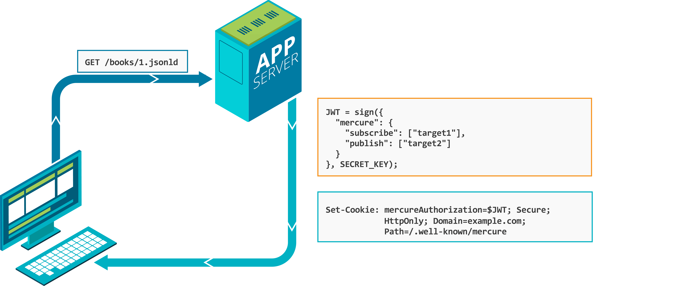

# Authorization

Mercure uses JWTs to decide who can publish, who can subscribe to private updates, and what topics they're allowed to use. The hub validates every token; your application code mints them.

> **Upgrading from 0.x?** The `mercure.publish` and `mercure.subscribe` claims must now contain **objects** (`{match, matchType, payload}`), not bare strings. The hub rejects bare strings with `401 Unauthorized`. See the [upgrade guide](../UPGRADE.md#10-from-0x).



## The token

A Mercure JWT is a regular [JWS](https://www.rfc-editor.org/rfc/rfc7515) with a `mercure` claim:

```json
{
  "mercure": {
    "publish": [
      { "match": "https://example.com/books/:id", "matchType": "URLPattern" }
    ],
    "subscribe": [
      { "match": "https://example.com/users/42/notifications" }
    ],
    "payload": {
      "user": "https://example.com/users/42"
    }
  },
  "exp": 1730000000
}
```

The hub verifies the signature with the key configured in `publisher_jwt` / `subscriber_jwt` (or via JWKS — see [Configuration](../deployment/configuration.md#jwt-validation-via-jwks)).

## Three ways to send the token

In order of preference:

1. **`Authorization: Bearer <token>` header.** Right for any client that can set custom headers — server-side code, mobile apps, CLI tools.
2. **`mercureAuthorization` cookie.** The only choice for browser `EventSource`, which can't set headers. Set the cookie at discovery time so it's already present when the SSE connection opens.
3. **`authorization` query parameter.** Last resort. Tokens leak into proxy logs, browser history, and `Referer` headers; use this only when nothing else works.

If a request carries multiple authorization sources, the header wins, then the query parameter, then the cookie.

The hub never sends tokens over plain HTTP. Whichever method you pick, **HTTPS is mandatory** for any non-anonymous request.

## Publishers

A publisher's JWT must carry `mercure.publish` and the hub must be able to match every topic in the request against at least one entry of the claim.

```json
{
  "mercure": {
    "publish": [
      { "match": "https://example.com/books/:id", "matchType": "URLPattern" },
      { "match": "https://example.com/announcements" }
    ]
  }
}
```

Behaviour:

- Empty `publish` array → publishing is forbidden (HTTP `403`).
- One topic in the publication doesn't match → the entire publication is rejected (HTTP `403`).
- `[{ "match": "*" }]` → every topic is allowed.

`*` is the only "match anything" wildcard; you cannot get the same effect with a permissive URL Pattern.

## Subscribers

A subscriber's JWT is **only consulted for private updates**. Public updates flow to any subscriber whose `match*` query parameters hit, with or without a token.

For a private update, the hub checks that the JWT's `mercure.subscribe` claim covers **at least one** of the update's topics (canonical or alternate). If yes, deliver. If not, drop silently — the subscriber doesn't see the update and gets no error.

```json
{
  "mercure": {
    "subscribe": [
      { "match": "https://example.com/users/42/:resource", "matchType": "URLPattern" },
      { "match": "https://example.com/announcements" }
    ]
  }
}
```

Empty `subscribe` array → no private updates can be received.

`[{ "match": "*" }]` → all private updates can be received.

### Anonymous subscribers

Hubs in development mode (or any hub with the `anonymous` directive set) accept subscribers without a JWT. Anonymous subscribers can only receive public updates — they have no `subscribe` claim to match against.

This is the right default for live feeds, public dashboards, and any case where the data isn't user-specific. For everything else, leave `anonymous` off.

## Per-user authorization on shared topics

A common pattern: a subscriber wants to receive updates about every book it has access to. A naive solution would be `matchURLPattern=https://example.com/books/:id` in the query, plus the same in `mercure.subscribe`. But that authorizes the subscriber for **every** book, including ones it shouldn't see.

The fix is alternate topics on the publish side, plus a per-user matcher in the claim:

```json
{
  "mercure": {
    "subscribe": [
      {
        "match": "https://example.com/users/42/?topic=:topic",
        "matchType": "URLPattern"
      }
    ]
  }
}
```

When publishing, attach an alternate topic that includes the user IDs allowed to see the update:

```console
curl -X POST $HUB -H "Authorization: Bearer $JWT" \
  -d 'topic=https://example.com/books/1' \
  -d 'topic=https://example.com/users/42/?topic=https%3A%2F%2Fexample.com%2Fbooks%2F1' \
  -d 'topic=https://example.com/users/99/?topic=https%3A%2F%2Fexample.com%2Fbooks%2F1' \
  -d 'private=on' \
  -d 'data=...'
```

The subscriber's `match*` query stays simple (`matchURLPattern=https://example.com/books/:id`). The hub checks that the subscriber's claim matches one of the alternates — only users 42 and 99 do, so only their tokens get the update.

## Payloads

Each entry in `mercure.subscribe` can carry a `payload` (any JSON value). The hub attaches the payload to the [subscription event](active-subscriptions.md) and the [subscription API](active-subscriptions.md#subscription-api) record for that subscription.

```json
{
  "mercure": {
    "subscribe": [
      {
        "match": "https://example.com/users/42",
        "payload": { "username": "alice", "ip": "10.0.0.1" }
      },
      {
        "match": "https://example.com/books/:id",
        "matchType": "URLPattern",
        "payload": { "username": "alice" }
      },
      {
        "match": ".*",
        "matchType": "Regexp",
        "payload": { "username": "alice" }
      }
    ]
  }
}
```

Which `payload` is attached to a given subscription is decided by the spec's [matching rules](../../spec/mercure.md#payloads):

1. The reserved string `*` always matches.
2. Same matcher type and identical pattern → match.
3. The claim matcher applied to the subscriber's `match` value (treated as a topic) returns true.

The first claim entry that matches wins. If none does, the hub falls back to `mercure.payload` at the top level (if present).

Use payloads to ship per-subscriber metadata to other subscribers via subscription events: usernames, group memberships, IP address, role.

## Cookies in detail

Set the cookie during discovery — when the user fetches the page or the API resource that links to the hub. By the time the browser opens the SSE connection, the cookie is already in place.

```http
HTTP/1.1 200 OK
Set-Cookie: mercureAuthorization=<JWT>; Domain=example.com; Path=/.well-known/mercure; Secure; HttpOnly; SameSite=Strict
Link: <https://hub.example.com/.well-known/mercure>; rel="mercure"
```

Required attributes:

- `Secure` — only sent over HTTPS.
- `HttpOnly` — not readable from JavaScript (XSS protection).
- `SameSite=Strict` or `Lax` — CSRF protection.
- `Path=/.well-known/mercure` — limits the cookie to the hub URL.

If the publisher and the hub run on different subdomains of the same registrable domain, set `Domain=example.com` on the cookie. If they're on different domains, you can't use cookies — fall back to the bearer header from a service worker, or use the `authorization` query parameter on a same-origin proxy.

`EventSource` does **not** send cookies on cross-origin requests by default. Pass `withCredentials: true` to opt in:

```javascript
new EventSource(url, { withCredentials: true });
```

The hub must respond with the right CORS headers; see [Configuration](../deployment/configuration.md#cors).

## Token expiration

If the JWT carries a standard `exp` claim, the hub closes the subscriber's connection at that time. The browser auto-reconnects, but with the now-expired token it fails — `401`.

To handle expiry cleanly:

- Set `exp` short enough to limit blast radius if a token leaks (minutes to hours, not days).
- On the application side, refresh the token before it expires and update the cookie. The next reconnection picks up the new token.
- For long-lived sessions, run a small endpoint on your origin that mints a fresh hub token in exchange for the user's session.

A token without `exp` keeps the connection open indefinitely. Don't ship that to production unless your threat model truly accepts a leaked token being valid forever.

## Validating with JWKS

For setups where an identity provider (Keycloak, Cognito, Auth0) issues the tokens, point the hub at its JWKS endpoint instead of hardcoding a key:

```caddyfile
mercure {
  publisher_jwks_url https://idp.example.com/.well-known/jwks.json
  subscriber_jwks_url https://idp.example.com/.well-known/jwks.json
}
```

The hub fetches and caches the keys, rotates them when the IdP rotates them, and validates each token against the matching `kid`. See [Configuration](../deployment/configuration.md#jwt-validation-via-jwks).

## RSA, ECDSA

The default algorithm is HS256 (symmetric HMAC). For asymmetric verification (the hub holds only the public key), set the `*_JWT_ALG` environment variable or pass the algorithm as the second argument of the directive:

```caddyfile
mercure {
  publisher_jwt {env.PUBLISHER_PUBLIC_KEY} RS256
  subscriber_jwt {env.SUBSCRIBER_PUBLIC_KEY} RS256
}
```

Asymmetric keys keep the signing key off the hub entirely — useful when the hub is operated by a different team than the publisher.

## Common errors

| Symptom | Cause |
| --- | --- |
| `401 Unauthorized` on subscribe | Missing token, expired token, bare-string claim entry (0.x format), wrong signing key |
| `403 Forbidden` on publish | Topic not covered by any `mercure.publish` entry, or claim missing entirely |
| Subscriber never receives a private update | Subscriber's `mercure.subscribe` doesn't cover any of the update's topics |
| Browser doesn't send the cookie | Missing `withCredentials: true`, wrong `Domain`/`Path`, or cross-origin without CORS credentials |

[Troubleshooting](../production/troubleshooting.md) covers each of these in more detail.
