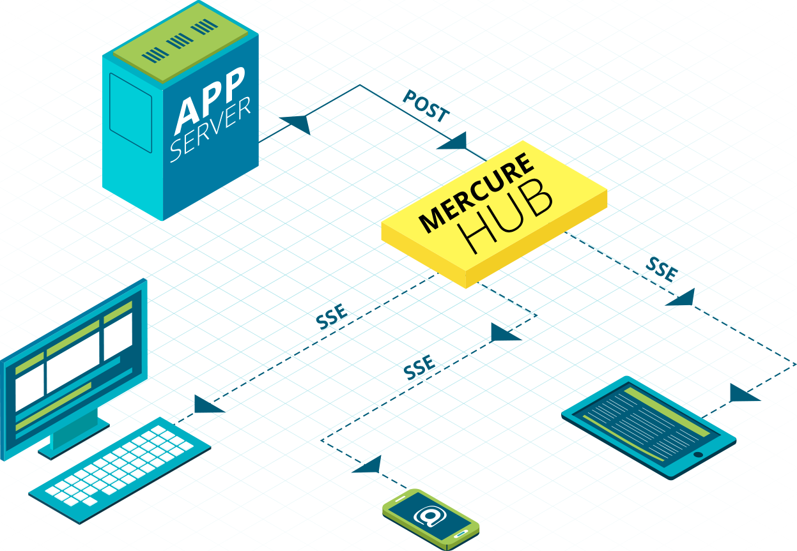

# Introduction

Mercure pushes data from a server to connected clients in real time, over plain HTTP. It's a thin protocol on top of [Server-Sent Events](https://html.spec.whatwg.org/multipage/server-sent-events.html), with a JWT-based authorization layer and a reconnection model that handles dropped connections without losing messages.

If you've ever wired up a WebSocket server just to push notifications, sync a UI, or stream tokens from an LLM, Mercure is the smaller thing you wanted instead.

## What you get

- **Native browser support.** No SDK. The `EventSource` API ships in every modern browser; on the server, any HTTP client can publish.
- **HTTP/2+ multiplexing.** One TCP connection carries every subscription a client opens, plus the rest of your app traffic.
- **Built-in reconnection and replay.** Clients reconnect automatically and resume from the last event they saw. The hub's history buffer fills the gap.
- **JWT authorization.** Sign tokens with the matchers a publisher or subscriber is allowed to use. The hub enforces them.
- **Hypermedia-friendly.** Topics are URLs. The protocol works with REST, GraphQL, JSON-LD, and HTML over the wire (Hotwire, htmx).
- **Encryption support.** Updates can be JWE-encrypted end-to-end, so even the hub operator cannot read them.

## What it's good for

- **LLM streaming.** Stream tokens or tool calls from a server-side model invocation to the browser as they arrive. ([Guide](use-cases/llm-token-streaming.md))
- **AI agent progress.** Push agent state to the UI: "searching the web", "reading file", "ran 3 tools, summarizing". ([Guide](use-cases/ai-agent-progress.md))
- **Live data.** Stock tickers, availability, IoT telemetry, dashboards. ([Guide](use-cases/live-data.md))
- **Collaborative editing.** Several users edit the same document; changes broadcast to everyone connected. ([Guide](use-cases/collaborative-editing.md))
- **Async jobs.** A worker computes a report; the result lands in the UI when ready. ([Guide](use-cases/async-jobs.md))
- **Notifications.** In-app toasts, mentions, mailbox counters. ([Guide](use-cases/notifications.md))

## How it differs from the alternatives

**vs. WebSockets.** WebSocket is a low-level transport; you still need to design framing, authorization, reconnection, replay, and presence. Mercure gives you all of that on top of HTTP/2, which most infrastructure already understands. For request/response inside the same connection, just use a regular `POST` — HTTP/2 already multiplexes it.

**vs. Pusher / Ably / Firebase / Supabase Realtime.** These are SaaS-only. Mercure is a protocol with an open-source reference hub: you own the data and the connections, and you can run it on your own infrastructure if compliance demands it. The free Mercure.rocks Hub has **unlimited connections and an unlimited history buffer**, bound only by the hardware you give it.

**vs. WebSub.** WebSub is server-to-server only. Mercure does server-to-server, server-to-client, and client-to-client over the same primitive.

**vs. Web Push.** The Push API targets *offline* devices through vendor servers (Apple, Google, Mozilla). Mercure targets *connected* clients with no third party in between and no payload-size limit.

See the [FAQ](reference/faq.md) for more.

## The free version is the production version

The Mercure.rocks Hub is licensed under AGPL-3.0. Concretely, that means you can:

- Run it on your own infrastructure with no connection limit, no message-rate limit, and no buffer cap other than disk size.
- Use it in production behind any HTTP/2 or HTTP/3 reverse proxy.
- Build any kind of application on top of it, commercial or otherwise. The AGPL applies to *modifications of the hub*, not to your application.

There are paid tiers — Cloud (managed) and Self-Hosted (multi-node, premium transports) — but the free tier is not crippleware. It's what runs the demo hub, what powers production deployments at companies pushing tens of millions of updates a day, and what you should reach for first.

When you outgrow a single node, [the production guide](production/high-availability.md) explains the options.

## Where to next

- [Quickstart](getting-started/quickstart.md) — running hub, first subscription, first update.
- [Topics and matchers](concepts/topics-and-matchers.md) — the part of the protocol that changed most in 1.0.
- [Read the specification](../spec/mercure.md) — also published as an [IETF Internet-Draft](https://datatracker.ietf.org/doc/draft-dunglas-mercure/) on track for RFC publication.
