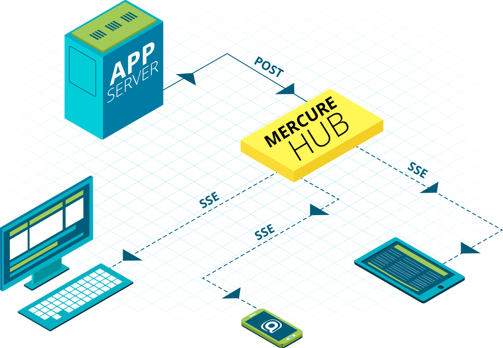

# What is Mercure?

Mercure brings your application to life: notifications arrive instantly, dashboards update themselves, and AI responses appear as they're generated. It pushes updates from your server to connected users over ordinary HTTP, with no browser SDK required.

If you've ever wired up a WebSocket server just to push notifications, sync a UI, or stream tokens from an LLM, Mercure is the simpler option you wanted. Built on [Server-Sent Events](https://html.spec.whatwg.org/multipage/server-sent-events.html), it handles authorization, reconnection, and replay so you can focus on your application.

**Ready to build? [Start with Mercure Cloud](https://mercure.rocks/pricing) and let us run the hub.** Need to keep everything on your infrastructure? [Mercure Enterprise](production/high-availability.md) brings clustering, shared transports, and direct support to your own servers. Both use the same open protocol as the free, open-source hub.

Your application sends an update to the hub. The hub delivers it to everyone watching the relevant topic, such as a conversation, a document, or an order.

## What you get with Mercure

- **Native browser support.** No SDK to install. Every modern browser has `EventSource`; any HTTP client can publish.
- **HTTP multiplexing.** HTTP/2 and HTTP/3 can carry multiple subscription streams over a shared connection to the same origin.
- **Built-in reconnection and replay.** `EventSource` reconnects automatically. The hub can replay missed events while they remain available in its history.
- **Presence.** When enabled, the hub publishes an event every time a subscription opens or closes, so "who's online" and "who's viewing this document" work without a separate service. ([Details](concepts/active-subscriptions.md))
- **JWT authorization.** Sign tokens with the matchers a publisher or subscriber is allowed to use. The hub enforces them.
- **Resource identifiers.** Topics can use your resource URLs. The protocol works with REST, GraphQL, JSON-LD, and HTML over the wire (Hotwire, htmx).
- **Encryption support.** Updates can be JWE-encrypted end-to-end, so even the hub operator cannot read them.

## What it's good for

- **LLM streaming.** Stream tokens or tool calls from a server-side model invocation to the browser as they arrive. ([Guide](use-cases/llm-token-streaming.md))
- **AI agent progress.** Push agent state to the UI: "searching the web", "reading file", "ran 3 tools, summarizing". ([Guide](use-cases/ai-agent-progress.md))
- **Live data.** Stock tickers, availability, IoT telemetry, dashboards. ([Guide](use-cases/live-data.md))
- **Collaborative editing.** Several users edit the same document; changes broadcast to everyone connected. ([Guide](use-cases/collaborative-editing.md))
- **Async jobs.** A worker computes a report; the result lands in the UI when ready. ([Guide](use-cases/async-jobs.md))
- **Notifications.** In-app toasts, mentions, mailbox counters. ([Guide](use-cases/notifications.md))

## How it differs from the alternatives

**vs. WebSockets.** WebSocket gives you a bidirectional connection. Mercure gives you the features a live application needs: topic authorization, reconnection, replay, and presence. Subscribe over SSE and send actions with ordinary HTTP requests; HTTP/2 and HTTP/3 can multiplex both on the same connection.

**vs. Pusher / Ably / Firebase / Supabase Realtime.** Choose Mercure when you want real-time features without tying your application to a provider's SDK or database. Use your existing backend, publish over HTTP, and subscribe with the browser's native API. Start on [Mercure Cloud](https://mercure.rocks/pricing), deploy [Enterprise on your infrastructure](production/high-availability.md), or run the open-source hub. Your publishing and subscription code uses the same protocol across all three. See the [comparison](reference/faq.md#whats-the-difference-between-mercure-and-pusher--ably--firebase--supabase-realtime).

**WebSub.** [WebSub](https://www.w3.org/TR/websub/) delivers updates to server callbacks. Mercure delivers an SSE stream, which browsers can consume directly.

**Web Push.** Web Push can notify users when the application is closed. Mercure sends updates while a client is connected; replay depends on retained history.

See the [FAQ](reference/faq.md) for more.

## Choose how you run Mercure

**Mercure Cloud: build your app, leave the hub to us.** Managed hosting includes automatic HTTPS and custom domains, with high availability on Pro plans and above. [Choose a Cloud plan](https://mercure.rocks/pricing).

**Mercure Enterprise: your infrastructure, backed by the maintainers.** Run a cluster on your own servers with Redis/Valkey, PostgreSQL, Kafka, or Pulsar. Keep control of your data and get direct support. With the Managed On-Premise option, we also deploy, monitor, and update the hub for you. [Explore Self-Hosted plans](https://mercure.rocks/pricing).

### The free version is a production version

The Mercure.rocks Hub is licensed under AGPL-3.0. Concretely, that means you can:

- Run it on your own infrastructure with no connection limit, no message-rate limit, and no buffer cap other than disk size.
- Use it in production behind a reverse proxy configured for streaming responses.
- Build any kind of application on top of it, commercial or otherwise. Independent applications can communicate with it over HTTP under their own licenses. See [License](reference/license.md).

Start with the [quickstart](getting-started/quickstart.md) to try it locally, or [choose Mercure Cloud](https://mercure.rocks/pricing) to skip installation. The [production guide](production/high-availability.md) explains clustering and Enterprise transports.

## Where to go next with Mercure

- [Quickstart](getting-started/quickstart.md): running hub, first subscription, first update.
- [Topics and matchers](concepts/topics-and-matchers.md): the part of the protocol that changed most in 1.0.
- [Read the specification](../spec/mercure.md): also published as an [IETF Internet-Draft](https://datatracker.ietf.org/doc/draft-dunglas-mercure/) for standardization.
